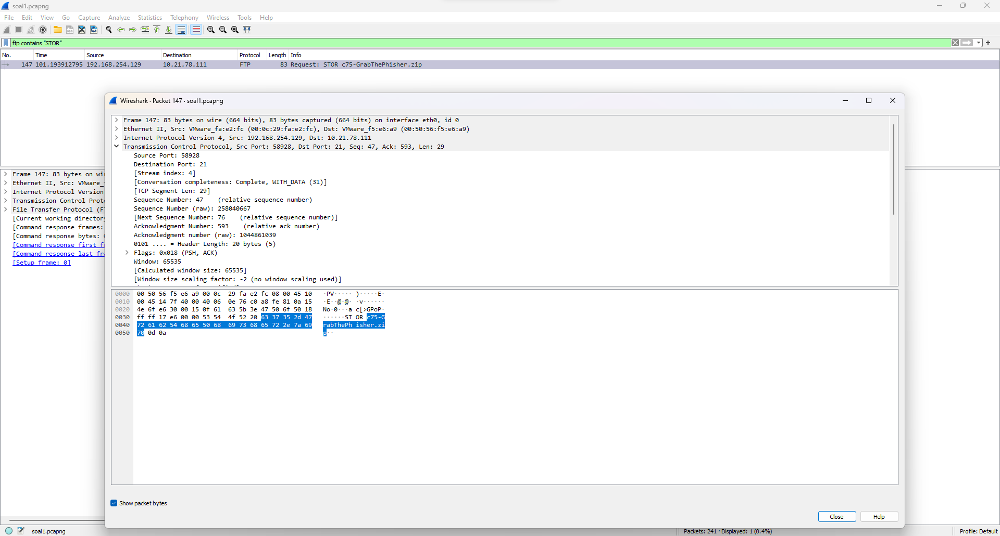
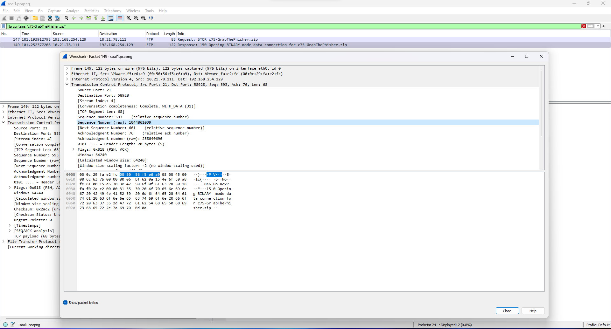
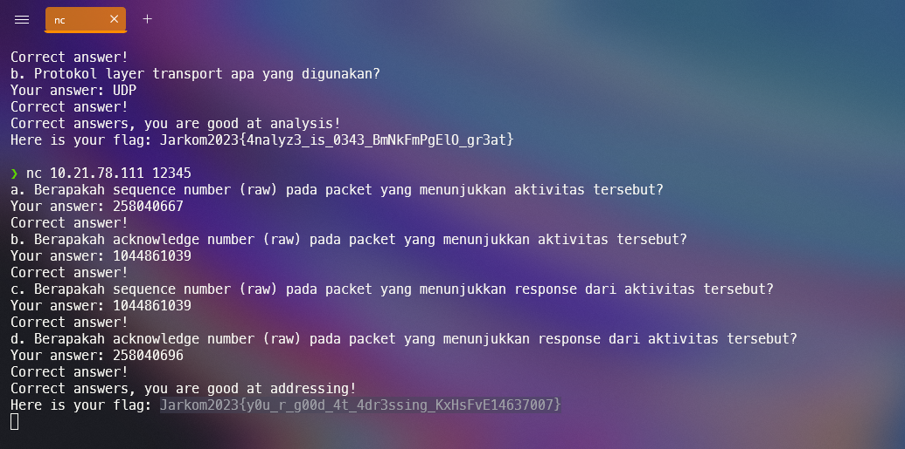
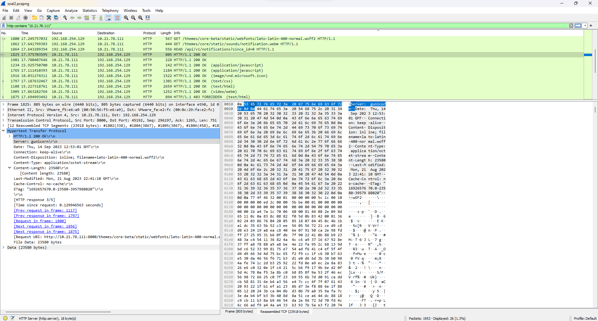
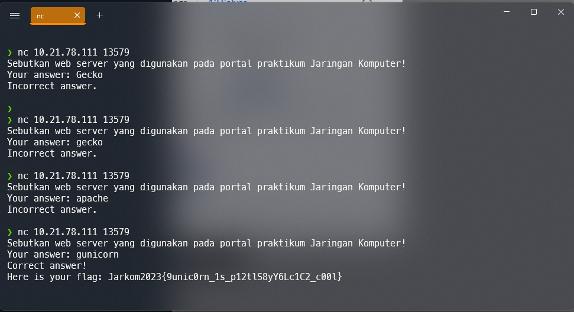
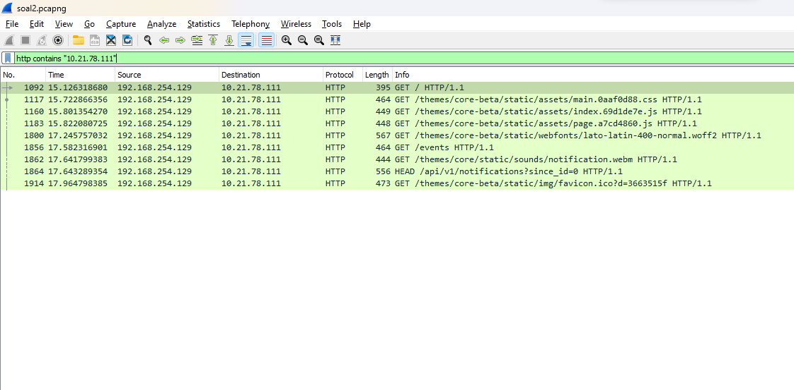
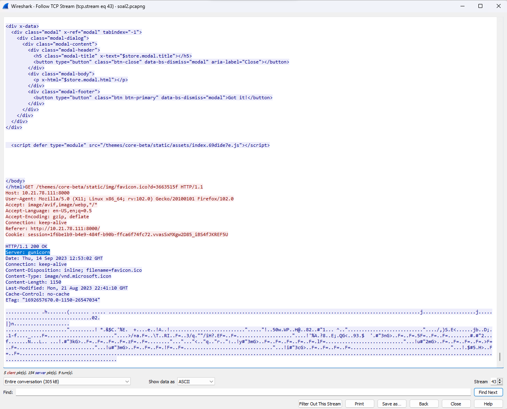
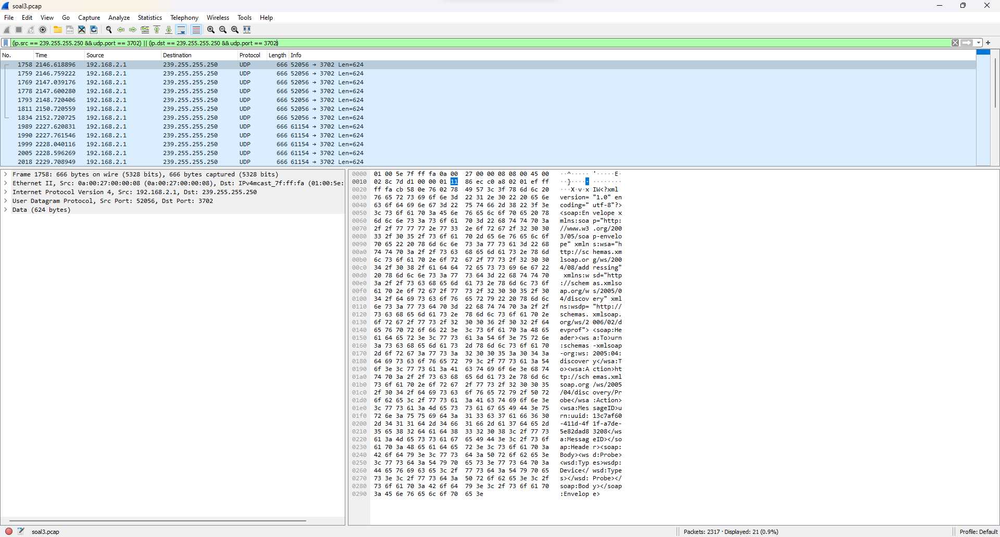
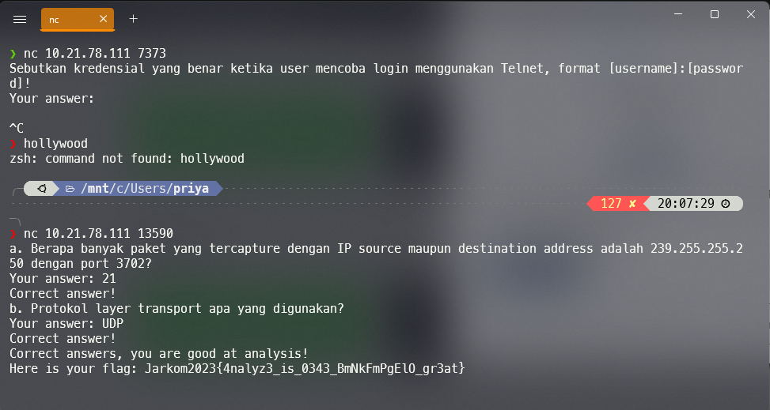

# Jarkom-Modul-1-B07-2023
> Laporan Resmi Praktikum 1 Jaringan Komputer B07
***
## Anggota Kelompok B07
1. I Gusti Ngurah Ervan Juli Ardana (5025211295)
2. Danar Sodik Priyambodo (5025211145)

## Daftar isi
+ [SOAL 1](#soal-1)
+ [SOAL 2](#soal-2)
+ [SOAL 3](#soal-3)
+ [SOAL 4](#soal-4)
+ [SOAL 5](#soal-5)
+ [SOAL 6](#soal-6)
+ [SOAL 7](#soal-7)
+ [SOAL 8](#soal-8)
+ [SOAL 9](#soal-9)
+ [SOAL 10](#soal-10)

---
## SOAL 1
### Pertanyaan
User melakukan berbagai aktivitas dengan menggunakan protokol FTP. Salah satunya adalah mengunggah suatu file.  
<li>Berapakah sequence number (raw) pada packet yang menunjukkan aktivitas tersebut? 
<li>Berapakah acknowledge number (raw) pada packet yang menunjukkan aktivitas tersebut? 
<li>Berapakah sequence number (raw) pada packet yang menunjukkan response dari aktivitas tersebut?
<li>Berapakah acknowledge number (raw) pada packet yang menunjukkan response dari aktivitas tersebut?

### Solusi
Pada soal no 1 kita diminta untuk mencari `sequence number (raw) & acknowledge number (raw) pada paket aktivitas tersebut (STOR)` dan juga `respon dari paket tersebut`, disini kita menggunakan ``ftp contains "STOR"``, kemudian menemukan sequence number (raw) & acknowledge number (raw) pada paket dan mengetahui nama dari paket tersebut dan melakukan filter kedua menggunakan ``ftp contains “c75-GrabThePhisher.zip”`` untuk mengetahui sequence number (raw) & acknowledge number (raw) pada response.

kendala : tidak mengalami kendala untuk nomor ini.

 

## SOAL 2
### Pertanyaan
Sebutkan web server yang digunakan pada portal praktikum Jaringan Komputer!

### Solusi
Pada soal no 2 kita diminta menyebutkan web server yang digunakan pada portal praktikum Jaringan Komputer, disini kita menggunakan `http contains “10.21.78.111”` yaitu website dari praktikum jarkom, kemudian memilih paket yang tertera ``HTTP/1.1 200 OK`` yang berarti website berhasil di akses, pilih menu tersebut untuk mengetahui web server yang digunakan akan muncul pada baris keterangan server yaitu gunicorn, atau dengan cara kedua adalah case apabila tidak muncul ``HTTP/1.1 200 OK`` adalah dengan membuka TCP Stream pada paket ``HTTP/1.1`` dan pada baris paling bawah terdapat informasi Server.

kendala : pada saat pertama kali melakukan filter contains dengan ip web jarkom, pada awalnya tidak muncul halaman web yang berhasil di akses atau ``HTTP/1.1 200 OK``,namun setelah kedua kalinya melakukan filter dan melakukan refresh, paket tersebut muncul dan dapat diketahui keterangan server yang digunakan.

cara pertama :

 

cara kedua: 

 

## SOAL 3
### Pertanyaan
Dapin sedang belajar analisis jaringan. Bantulah Dapin untuk mengerjakan soal berikut:
<li>Berapa banyak paket yang tercapture dengan IP source maupun destination address adalah 239.255.255.250 dengan port 3702?
<li>Protokol layer transport apa yang digunakan?

### Solusi
Pada soal no 3 kita diminta paket yang tercapture dengan IP source maupun destination address adalah `239.255.255.250` dengan `port 3702` dan juga Protokol layer transport apa yang digunakan. maka menggunakan filter `(ip.src == 239.255.255.250 && udp.port == 3702) || (ip.dst == 239.255.255.250 && udp.port == 3702)` untuk mencari ip source maupun destination yang sesuai dengan udp port yang di tentukan, dan menghasilkan ``21 paket`` yang tercapture dan protokol layer transport yang digunakan juga tertera adalah `UDP`.

kendala : tidak mengalami kendala untuk nomor ini.

## SOAL 4
### Pertanyaan
Berapa nilai checksum yang didapat dari header pada paket nomor 130?
### Solusi
Pada soal no 4 kita diminta untuk mencari nilai checksum yang didapat dari header pada paket nomor 130. Caranya kita hanya perlu scroll hingga menuju paket 130, kemudian klik paket tersebut dan expand bagian user datagram protocol. Kemudian kita hanya perlu menyalin checksum tersebut sebagai jawabanya

Setelah mendapatkan nilai checksum kita perlu menyalin checksum tersebut dan bawa ke terminal

---
## SOAL 5
### Pertanyaan
Elshe menemukan suatu file packet capture yang menarik. Bantulah elshe untuk menganalisis file packet capture tersebut.

a. Berapa banyak packet yang berhasil di capture dari file pcap tersebut?

b. Port berapakah pada server yang digunakan untuk service SMTP?

c. Dari semua alamat IP yang tercapture, IP berapakah yang merupakan public IP? 
### Solusi
pada soal no 5 kita diminta untuk menganalisis file packet capture yang telah ada. caranya pertama kita perlu menginstall zip dan soal5.pcap yang tersedia di soal. kemudian kita buka dan search packet yang berisi pass dari txt yang ada di file zip tersebut

selanjutnya kita perlu membuka TCP stream dari packet tersebut maka akan muncul password yang ada

namun seperti arahan diatas, kita perlu decode password tersebut di base64 pada google 

Akhirnya kita tahu password untuk membuka file connect.txt yang diberikan. Kemudian, setelah mendapat password kita hanya perlu membuka connect.txt dan didalamnya ada kode nc yang akan kita masukan ke terminal. Lalu setelah berhasil membuka di terminal kita perlu menjawab beberapa pertanyaan yang ada dibawah

solusi dari soal a bisa dilihat langsung pada wireshark 

solusi dari soal b,c,d bisa kita lihat info pada transmission control protocol 

---
## SOAL 6
### Pertanyaan
Seorang anak bernama Udin Berteman dengan SlameT yang merupakan seorang penggemar film detektif. sebagai teman yang baik, Ia selalu mengajak slamet untuk bermain valoranT bersama. suatu malam, terjadi sebuah hal yang tak terdUga. ketika udin mereka membuka game tersebut, laptop udin menunjukkan sebuah field text dan Sebuah kode Invalid bertuliskan "server SOURCE ADDRESS 7812 is invalid". ketika ditelusuri di google, hasil pencarian hanya menampilkan a1 e5 u21. jiwa detektif slamet pun bergejolak. bantulah udin dan slamet untuk menemukan solusi kode error tersebut.
### Solusi
pada soal 6 kita diminta untuk menemukan solusi kode error yang telah diberikan pada soal. Caranya yaitu karena kode Invalid yang diberikan bertuliskan "server SOURCE ADDRESS 7812 is invalid"  maka kita harus mencari packer ke-7812 pada wireshark. 

Kemudian kita diberi clue oleh soal berupa "ketika ditelusuri di google, hasil pencarian hanya menampilkan a1 e5 u21." dari clue tersebut berarti kita harus menyatukan alphabet dengan angka. Maksudnya, A = 1, B = 2, C = 3 begitupun seterusnya hingga Z = 26. Setelah itu kita hanya perlu melihat Source yang ada pada packet ke 7812. Sourcenya berisikan 104.18.14.101 dan kita ubah angka tersebut menjadi alphabet sebagai kode. angka tersebut dapat dipecah menjadi 10 = J , 4 = D , 18 = R , 14 = N , 10 = J , 1 = A. Terakhir kita hanya perlu menyalin kode tersebut ke terminal

---
## SOAL 7
### Pertanyaan
Berapa jumlah packet yang menuju IP 184.87.193.88?
### Solusi
pada soal no 7 kita hanya diminta untuk mencari jumlah packet yang menuju IP 184.87.193.88. Caranya, kita hanya perlu menuju destinasi ip yang kita inginkan dengan memasukan query ip.dst == 184.87.193.88. nantinya program akan menampilkan semua paket yang menggunakan ip tersebut

dari hasil filter menggunakan tersebut, didapat 6 jumlah paket yang muncul

---
## SOAL 8
### Pertanyaan
Berikan kueri filter sehingga wireshark hanya mengambil semua protokol paket yang menuju port 80! (Jika terdapat lebih dari 1 port, maka urutkan sesuai dengan abjad)!
### Solusi
pada soal no 8. kita hanya diminta untuk membuat kueri filter sehingga wireshark hanya mengambil semua protokol paket yang menuju port 80! (Jika terdapat lebih dari 1 port, maka urutkan sesuai dengan abjad). Caranya kita hanya perlu memasukan query berikut tcp.dstport == 80 || udp.dstport == 80. query diatas akan memilih paket-paket yang memiliki port tujuan (destination port) 80 dalam protokol TCP atau UDP. 

---
## SOAL 9
### Pertanyaan
Berikan kueri filter sehingga wireshark hanya mengambil paket yang berasal dari alamat 10.51.40.1 tetapi tidak menuju ke alamat 10.39.55.34!
### Solusi
pada soal no 9 kita diminta hanya untuk membuat kueri filter sehingga wireshark hanya mengambil paket yang berasal dari alamat 10.51.40.1 tetapi tidak menuju ke alamat 10.39.55.34. caranya kita hanya menggunakan query ip.src == 10.51.40.1 && ip.dst != 10.39.55.34. query tersebut berarti menampilkan ip 10.51.40.1 dengan ip.src == 10.51.40.1 tetapi tidak memunculkan ip 10.39.55.34 dengan ip.dst != 10.39.55.34.

Kemudian kita hanya perlu menyalin query tersebut ke terminal

---
## SOAL 10
### Pertanyaan
Sebutkan kredensial yang benar ketika user mencoba login menggunakan Telnet!
### Solusi

pada soal no 10 kita diminta untuk menyebutkan kredensial yang benar ketika user mencoba login menggunakan Telnet!. caranya pertama tama kita filter semua packet dengan kata telnet 

Kemudian, kita hanya perlu membuka TCPstream pada packet yang berisi telnet data isinya sebagai berikut

setelah mendapatkan password, kemudian kita hanya perlu menyalin password menuju terminal

